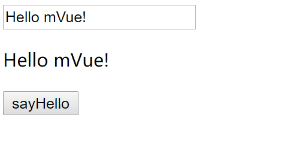

# mVue

`Vue`学习并使用了一段时间，对`Vue`如何实现双向绑定有了初步的理解，这里参考[`Vue`源码](https://github.com/vuejs/vue)，尝试一步步实现一个简单的`MVVM`。

## 单向数据绑定
现在主流的`MVC`框架都实现了单向数据绑定，单向数据绑定就是先把模板写好，把模板和数据整合并形成HTML代码，
然后把这段`HTML`代码插入到文档。但是HTML代码一旦生成以后，就无法再变了，如果数据改变，就必须替换掉HTML代码。

## 实现双向绑定的方法
双向绑定，其实就是在单向绑定的基础上给`input`、`textarea`等可输入元素添加了`change(input)`事件，实现动态修改`model`和`view`。

### 发布订阅模式 （backbone.js）
使用自定义的`data`属性在`HTML`代码中指明绑定。所有绑定起来的`JavaScript`对象以及`DOM`元素都将**订阅**一个发布者对象。
如果`JavaScript`对象或者一个`HTML`输入字段被侦测到发生了变化，将代理事件到发布者-订阅者模式，反过来将变化广播并传播到所有绑定的对象和元素。

### 脏值检查（angular.js）
Angular的实现方式，当发生了某种事件（例如输入），`Angular`会检查新的数据结构和之前的数据结构是否发生了变动，来决定是否更新视图。
最简单的方式就是通过`setInterval()`定时轮询检测数据变动，`Angular`只有在下面的事件触发时才会进入脏值检测：

- `DOM`事件，譬如用户输入文本，点击按钮等。(`ng-click`)
- `XHR`响应事件 (`$http`)
- 浏览器`Location`变更事件 (`$location`)
- `Timer`事件(`$timeout`, `$interval`)
- 执行`$digest()`或`$apply()`

### 数据劫持（vue.js）
`Vue.js`则是采用数据劫持结合发布者-订阅者模式的方式，通过`Object.defineProperty()`来劫持各个属性的`setter`，`getter`，在数据变动时发布消息给订阅者，触发相应的监听回调。

## 实现思路

### Object.defineProperty

了解了原理，`Vue`最核心的方法便是通过`Object.defineProperty()`实现对属性的劫持，监听数据变动。先了解一下`Object.defineProperty`。
`Object.defineProperty`方法允许通过属性描述对象，定义或修改一个属性，然后返回修改后的对象，用法：
```javascript
Object.defineProperty(object, propertyName, attributesObject)

//例子
var student = Object.defineProperty({}, 'name', {
  value: 'xiaoming',
  writable: false,
  enumerable: true,
  configurable: false
});

obj.name // 'xiaoming'

obj.name = 'xiaogang';
obj.name // 'xiaoming'
```
`Object.defineProperty`方法有三个参数：
- `object`：定义或修改属性的对象(`Object`)
- `propertyName`：属性名（`String`）
- `attributesObject`：属性描述对象(`Object`)
  - `value`：属性的值，默认是`undefined`
  - `writable`：(`Boolean`) 属性值是否可写，默认为`true`
  - `enumerable`：(`Boolean`) 属性是否可遍历，默认为`true`。如果设为`false`，会使得某些操作（比如`for...in`循环、`Object.keys()`）跳过该属性。
  - `configurable`：(`Boolean`) 是否可配置，默认为`true`。如果设为`false`，将阻止某些操作，比如无法删除该属性，也不得改变该属性的属性描述对象（`value`属性除外）。
  也就是说，`configurable`属性控制了属性描述对象的可写性。
  - `get`：是一个函数，表示该属性的取值函数（`getter`），默认为`undefined`。
  - `set`：是一个函数，表示该属性的存值函数（`setter`），默认为`undefined`。

> **注意，一旦定义了取值函数`get`（或存值函数`set`），就不能将`writable`属性设为`true`，或者同时定义`value`属性，否则会报错。**

### Observer
上面说到利用`Obeject.defineProperty()`来监听属性变动，接下来需要实现一个数据监听器`Observer`，监控`data`的属性值，如有变动可拿到最新值并通知订阅者。
```javascript

function Observer(data) {
  this.data = data;
  this.walk(data);
}

Observer.prototype = {
  walk: function(data) {
    var self = this;
    if (!data || typeof data !== 'object') {
      return;
    }

    // 遍历data所有属性
    Object.keys(data).forEach(function(key) {
      self.defineReactive(data, key, data[key]);
    });
  },
  defineReactive: function(data, key, value) {
    var dep = new Dep();
    //递归遍历所有子属性
    observe(value);

    //添加 setter和getter
    Object.defineProperty(data, key, {
      enumerable: true,
      configurable: false,
      get: function () {
        if (Dep.target) {
          //js是单线程的，这个全局变量在同一时间只会有同一个监听器使用
          dep.addSub(Dep.target);
        }
        return value;
      },
      set: function (newValue) {
        if (newValue === value) {
          return;
        }
        value = newValue;

        // 通知所有订阅者
        dep.notify();
      }
    });
  }
};

function observe(value) {
  if (!value || typeof value !== 'object') {
    return;
  }
  return new Observer(value);
}
```

上面的代码中，定义了一个`observer`类，参数是`data`属性，递归遍历`data`的属性，并利用`Obeject.defineProperty()`劫持属性。
在`getter`和`setter`函数中，有一个`Dep`对象，`Dep`对象作为一个收集订阅者的容器，实现了订阅发布模式（一对多），当状态发生改变时就会通知所有订阅者对象。实现如下：
```javascript
function Dep () {
  this.subs = [];
}
Dep.prototype = {
  addSub: function(sub) {
    this.subs.push(sub);
  },
  notify: function() {
    this.subs.forEach(function(sub) {
      sub.update();
    });
  }
};
Dep.target = null;
```
### Compile
接下来需要实现一个解析器`Compile`来做解析和绑定工作：
- 解析模板指令(`v-model`)，并替换模板数据(`双大括号`)，初始化视图
- 将模板指令对应的节点绑定对应的更新函数，初始化相应的订阅器

解析模板，需要获取到`dom`元素，然后对含有`DOM`元素上含有指令的节点进行处理，因此需要对`DOM`操作比较频繁，操作`DocumentFragment`节点，要比直接操作`DOM`快得多，
所以为提高性能和效率，可以先建一个`fragment`片段，将需要解析的`dom`节点存入`fragment`片段里再进行处理：

```javascript
function Compile(el, vm) {
    this.vm = vm;
    this.el = this.isElementNode(el) ? el : document.querySelector(el);
    this.fragment = null;
    this.init();
}
Compile.prototype = {
    init: function () {
        if (this.el) {
            this.fragment = this.nodeToFragment(this.el);
            this.compileElement(this.fragment);
            this.el.appendChild(this.fragment);
        } else {
             console.log('Cannot find the element.');
        }
    },
    nodeToFragment: function (el) {
        var fragment = document.createDocumentFragment();
        var child = el.firstChild;
        // 将Dom节点拷贝到fragment中
        while (child) {
            fragment.appendChild(child);
            child = el.firstChild
        }
        return fragment;
    },
};
```

在`compileElement`方法中，先解析含有双大括号的变量：
```javascript
compileElement: function (el) {
    var childNodes = el.childNodes;
    var self = this;
    [].slice.call(childNodes).forEach(function(node) {
        var reg = /\{\{(.*)\}\}/;
        var text = node.textContent;

        if (self.isElementNode(node)) {
            self.compile(node);
        } else if (self.isTextNode(node) && reg.test(text)) {  // 判断是否是符合这种形式{{}}的指令
            self.compileText(node, reg.exec(text)[1]);
        }

        if (node.childNodes && node.childNodes.length) {
            self.compileElement(node);
        }
    });
},
compile: function(node) {
    var nodeAttrs = node.attributes;
    var self = this;
    Array.prototype.forEach.call(nodeAttrs, function(attr) {
        var attrName = attr.name;
        if (self.isDirective(attrName)) {
            var exp = attr.value;
            var dir = attrName.substring(2);
            if (self.isEventDirective(dir)) {  // 事件指令
                self.compileEvent(node, self.vm, exp, dir);
            } else {  // v-model 指令
                self.compileModel(node, self.vm, exp, dir);
            }
            node.removeAttribute(attrName);
        }
    });
},
compileText: function(node, exp) {
    var self = this;
    var initText = this.vm[exp];
    this.updateText(node, initText);
    new Watcher(this.vm, exp, function (value) {
      self.updateText(node, value);
    });
},
compileModel: function (node, vm, exp, dir) {
    var self = this;
    var val = this.vm[exp];
    this.modelUpdater(node, val);
    new Watcher(this.vm, exp, function (value) {
      self.modelUpdater(node, value);
    });

    node.addEventListener('input', function(e) {
      var newValue = e.target.value;
      if (val === newValue) {
        return;
      }
      self.vm[exp] = newValue;
      val = newValue;
    });
},
isElementNode: function (node) {
    return node.nodeType === 1;
},
isTextNode: function(node) {
    return node.nodeType === 3;
}
```
### watcher
订阅者`Watcher`在初始化的时候需要将自己添加进订阅器`Dep`中

```javascript
function Watcher(vm, exp, cb) {
  this.cb = cb;
  this.vm = vm;
  this.exp = exp;
  this.value = this.get();  // 将自己添加到订阅器的操作
}

Watcher.prototype = {
  update: function() {
    // 收到属性值变化的通知
    this.run();
  },
  run: function() {
    var value = this.get();// 获取最新值
    var oldVal = this.value;
    if (value !== oldVal) {
      this.value = value;
      this.cb.call(this.vm, value, oldVal);
    }
  },
  get: function() {
    Dep.target = this;  // 缓存当前Watcher对象
    var value = this.vm.data[this.exp]; // 触发getter，添加自己到属性订阅器中
    Dep.target = null;  // 释放Watcher对象
    return value;
  }
};
```

## mVue
```javascript
function mVue (options) {
  var self = this;
  this.data = options.data;
  this.methods = options.methods;
  Object.keys(this.data).forEach(function(key) {
    self.proxyKeys(key);
  });

  observe(this.data);
  new Compile(options.el, this);
}

mVue.prototype = {
  proxyKeys: function (key) {
    var self = this;
    Object.defineProperty(this, key, {
      enumerable: false,
      configurable: true,
      get: function getter () {
        return self.data[key];
      },
      set: function setter (newVal) {
        self.data[key] = newVal;
      }
    });
  }
};
```
## 效果
```html
<!DOCTYPE html>
<html lang="en">
<head>
    <meta charset="UTF-8">
    <title>mVue demo</title>
</head>
<body>
<div id="app">
    <input type="text" v-model="message">
    <p>{{ message }}</p>
    <button v-on:click="sayHello">sayHello</button>
</div>

<script src="./js/observer.js"></script>
<script src="./js/watcher.js"></script>
<script src="./js/compile.js"></script>
<script src="./js/mVue.js"></script>
<script>
  var vm = new mVue({
    el: '#app',
    data: {
      message: 'Hello mVue!'
    },
    methods: {
      sayHello: function() {
        this.message = 'Hello!';
      }
    }
  });
</script>
</body>
</html>
```



## 总结
- `Observer`利用`Obeject.defineProperty()`来监听属性变动，监控`data`的属性值，如有变动可拿到最新值并通知订阅者。
- `Dep`对象作为一个收集订阅者的容器，实现了订阅发布模式（一对多），当状态发生改变时就会通知所有订阅者对象。
- `Compile`来做解析和绑定工作：
  - 解析模板指令(`v-model`)，并替换模板数据(`双大括号`)，初始化视图。
  - 将模板指令对应的节点绑定对应的更新函数，初始化相应的订阅器。
  - 操作`DocumentFragment`节点，要比直接操作`DOM`快得多，所以为提高性能和效率，可以先建一个`fragment`片段，将需要解析的`dom`节点存入`fragment`片段里再进行处理。
  - 注意解析`v-model`指令，只是给可输入节点通过 `addEventListener` 监听 `input`事件，并在回调函数修改data对象对应属性的值。
- `mVue`通过`proxyKeys`方法代理`data`对象的所有属性。

## [深入Vue](deep/)


