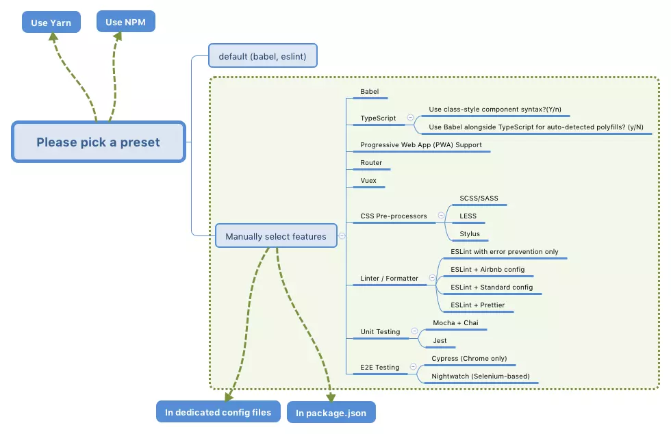
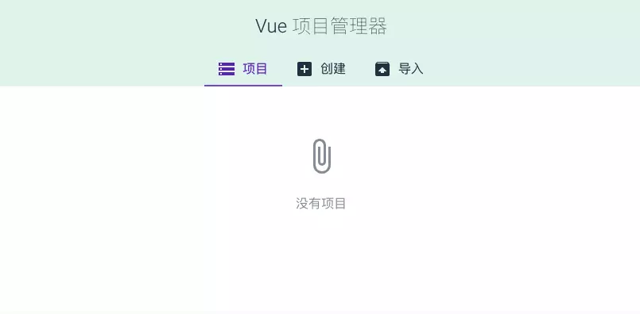

# Vue CLI 3 项目构建基础
## 依赖
- Node.js

## 脚手架
### 什么是脚手架
脚手架可以理解为能够帮助我们快速构建前端项目的一个工具或平台。

### vue-cli
Vue 的脚手架工具`vue-cli`，目前最新的版本是 3.x。CLI 3.x 版本和 2.x 版本存在着很大的区别。

#### 安装
```shell
# 安装 Vue CLI 3.x
npm i -g @vue/cli

# 或者
yarn global add @vue/cli
```

#### 构建
```shell
# my-project 是你的项目名称
vue create my-project
```
执行完上述命令后，会出现一系列的选择项，流程图如下：



如果你只想构建一个基础的 Vue 项目，那么使用 Babel、Router、Vuex、CSS Pre-processors 就足够了，最后选择你喜欢的包管理工具 npm or yarn。

#### 启动
```shell
# 打开项目目录
cd vue-project

# 启动项目
yarn serve

# or
npm run serve
```
如果启动的时候出现报错或者包丢失等情况，最好将 node 或者 yarn （如果使用）的版本更新到最新重新构建。

成功后打开浏览器地址：http://localhost:8080/

#### 目录结构
```
├── node_modules     # 项目依赖包目录
├── public
│   ├── favicon.ico  # ico图标
│   └── index.html   # 首页模板
├── src
│   ├── assets       # 样式图片目录
│   ├── components   # 组件目录
│   ├── views        # 页面目录
│   ├── App.vue      # 父组件
│   ├── main.js      # 入口文件
│   ├── router.js    # 路由配置文件
│   └── store.js     # vuex状态管理文件
├── .gitignore       # git忽略文件
├── .postcssrc.js    # postcss配置文件
├── babel.config.js  # babel配置文件
├── package.json     # 包管理文件
└── yarn.lock        # yarn依赖信息文件
```

### 可视化界面
除了使用上述命令行构建外，vue-cli 3.x 还提供了可视化的操作界面，在项目目录下我们运行如下命令开启图形化界面：
```shell
vue ui
```

之后浏览器会自动打开本地 8000 端口，页面如下：



如果你还没有任何项目，那么可以点击创建或者直接导入现有的项目。创建项目和我们使用命令行的步骤基本相同。
