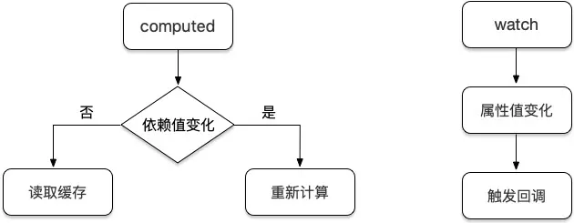
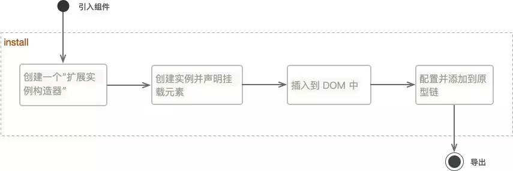
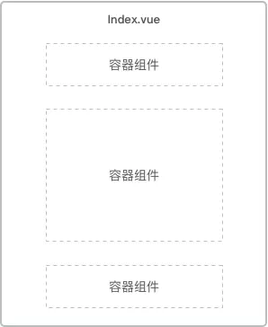

# 指南
## 编码技巧与规范
### 使用 Array.from 快速生成数组
```js
let hours = [];

for (let i = 0; i < 24; i++) {
    hours.push(i + '时');
}

// 改写
let hours = Array.from({ length: 24 }, (value, index) => index + '时');
```

### 使用 router.beforeEach 来处理跳转前逻辑
在某些情况下，我们需要在路由跳转前处理一些特定的业务逻辑，比如修改路由跳转、设置 title 等，代码如下：
```js
import Vue from 'vue'
import Router from 'vue-router'

Vue.use(Router)

// 首页
const Home = (resolve => {
    require.ensure(['../views/home.vue'], () => {
        resolve(require('../views/home.vue'))
    })
})

let base = `${process.env.BASE_URL}`;

let router =  new Router({
    mode: 'history',
    base: base,
    routes: [
        {
            path: '/',
            name: 'home',
            component: Home,
            meta: { title: '首页' }
        },
    ]
})

router.beforeEach((to, from, next) => {
    let title = to.meta && to.meta.title;

    if (title) {
        document.title = title; // 设置页面 title
    }

    if (to.name === 'home') {

        // 拦截并跳转至 page2 单页，$openRouter 方法在第 5 节中封装
        Vue.$openRouter({
            name: 'page2'
        });
    }

    next();
})

export default router
```
**注意最后需要调用`next()`方法执行路由跳转**。

### 使用 v-if 来优化页面加载
在 Vue 页面中，一些模块可能需要用户主动触发才会显示，比如弹框组件等这样的子组件，那么我们可以使用`v-if`来进行按需渲染，没必要一进页面就渲染所有模块。比如：
```html
<template>
    <div @click="showModuleB = true"></div>
    <module-b v-if="isShowModuleB"></module-b>
</template>

<script>
import moduleB from 'components/moduleB'
export default {
    data() {
        return {
            isShowModuleB: false
        }
    },
    components: {
        moduleB
    }
}
</script>
```
这样当 isShowModuleB 为 false 的时候便不会加载该模块下的代码，包括一些耗时的接口调用。当然`v-if`主要适用于代码量较多、用户点击不是很频繁的模块的显示隐藏，
同时如果涉及到权限问题的代码都需要使用`v-if`，而不是`v-show`。

### 路由跳转尽量使用 name 而不是 path
我们前期配置的路由路径后期难免会进行修改，如果我们页面跳转的地方全是使用的 path，那么我们需要修改所有涉及该 path 的页面，这样不利于项目的维护。而
相对于 path，name 使用起来就方便多了，因为其具有唯一性，即使我们修改了 path，还可以使用原来的 name 值进行跳转。
```js
this.$router.push({
    name: 'page1'
});

// 而不是
this.$router.push({
    path: 'page1'
});
```

### 使用 key 来优化 v-for 循环
`v-for`是 Vue 提供的基于源数据多次渲染元素或模板块的指令。正因为是数据驱动，所以在修改列表数据的时候，Vue 内部会根据 key 值去判断某个值是否被修改，
其会重新渲染修改后的值，否则复用之前的元素。

这里如果数据中存在唯一表示 id，则推荐使用 id 作为 key，如果没有则可以使用数组的下标 index 作为 key。因为如果在数组中间插入值，其之后的 index 会发生改变，
即使数据没变 Vue 也会进行重新渲染，所以最好的办法是使用数组中不会变化且唯一的那一项作为 key 值。例如：
```js
<template>
    <ul>
        <li v-for="(item, index) in arr" :key="item.id">{{ item.data }}</li>
    </ul>
</template>

<script>
export default {
    data() {
        return {
            arr: [
                {
                    id: 1,
                    data: 'a'
                },
                {
                    id: 2,
                    data: 'b'
                },
                {
                    id: 3,
                    data: 'c'
                }
            ]
        }
    }
}
</script>
```

### 使用 computed 代替 watch
很多时候页面会出现 watch 的滥用而导致一系列问题的产生，而通常更好的办法是使用 computed 属性，首先需要区别它们有什么区别：

- watch：当监测的属性变化时会自动执行对应的回调函数
- computed：计算的属性只有在它的相关依赖发生改变时才会重新求值

其实它们在功能上还是有所区别的，但是有时候可以实现同样的效果，而 computed 会更胜一筹，比如：
```html
<template>
    <div>
        <input type="text" v-model="firstName">
        <input type="text" v-model="lastName">
        <span>{{ fullName }}</span>
        <span>{{ fullName2 }}</span>
    </div>
</template>

<script>
export default {
    data() {
        reurn {
            firstName: '',
            lastName: '',
            fullName2: ''
        }
    },

    // 使用 computed
    computed: {
        fullName() {
            return this.firstName + ' ' + this.lastName
        }
    },

    // 使用 watch
    watch: {
        firstName: function(newVal, oldVal) {
            this.fullName2 = newVal + ' ' + this.lastName;
        },
        lastName: function(newVal, oldVal) {
            this.fullName2 = this.firstName + ' ' + newVal;
        },
    }
}
</script>
```
上方我们通过对比可以看到，在处理多数据联动的情况下，使用 computed 会更加合理一点。



computed 监测的是依赖值，依赖值不变的情况下其会直接读取缓存进行复用，变化的情况下才会重新计算；而 watch 监
测的是属性值，只要属性值发生变化，其都会触发执行回调函数来执行一系列操作。

### 统一管理缓存变量
在项目中或多或少会使用浏览器缓存，比如 sessionStorage 和 localStorage，当一个项目中存在很多这样的缓
存存取情况的时候就会变得难以维护和管理，因为其就像全局变量一样散落在项目的各个地方，这时候我们应该将这些变量统一管理起来，放到一个或多个文件中去，比如：
```js
/* types.js */

export const USER_NAME = 'userName';
export const TOKEN = 'token';
```
在需要存取的时候，直接引用：
```js
import { USER_NAME, TOKEN } from '../types.js'

sessionStorage[USER_NAME] = '张三';
localStorage[TOKEN] = 'xxx';
```
好处在于一旦我们需要修改变量名，直接修改管理文件中的值即可，无需修改使用它的页面，同时这也可以避免命名冲突等问题的出现，这类似于 vuex 中 mutations 变量的管理。

### 使用 setTimeout 代替 setInterval
一般情况下我们在项目里不建议使用 setInterval，因为其会存在代码的执行间隔比预期小以及 “丢帧” 的现象，原因在于其本身的实现逻辑。很多人会认
为 setInterval 中第二个时间参数的作用是经过该毫秒数执行回调方法，其实不然，其真正的作用是经过该毫秒数将回调方法放置到队列中去，但是如果队
列中存在正在执行的方法，其会等待之前的方法完毕再执行，如果存在还未执行的代码实例，其不会插入到队列中去，也就产生了 “丢帧”。

而 setTimeout 并不会出现这样的现象，因为每一次调用都会产生了一个新定时器，同时在前一个定时器代码执行完之前，不会向队列插入新的定时器代码。
```js
// 该定时器实际会在 3s 后立即触发下一次回调
setInterval(() => {
    // 执行完这里的代码需要 2s
}, 1000);

// 使用 setTimeout 改写，4秒后触发下一次回调
let doSometing = () => {
    // 执行完这里的代码需要 2s

    setTimeout(doSometing, 1000);
}

doSometing();
```

### 不要使用 for in 循环来遍历数组
大家应该都知道 for in 循环是用于遍历对象的，但它可以用来遍历数组吗？答案是可以的，因为数组在某种意义上也是对象，但是如果用其遍历数组会存在一些隐患：
**其会遍历数组原型链上的属性**。
```js
let arr = [1, 2];

for (let key in arr) {
    console.log(arr[key]); // 会正常打印 1, 2
}

// 但是如果在 Array 原型链上添加一个方法
Array.prototype.test = function() {};

for (let key in arr) {
    console.log(arr[key]); // 此时会打印 1, 2, ƒ () {}
}
```
因为我们不能保证项目代码中不会对数组原型链进行操作，也不能保证引入的第三方库不对其进行操作，所以不要使用 for in 循环来遍历数组。

## 编写可复用性模块
### 封装成一个函数
除了使用变量的赋值缓存使用来解决数据的重复读取外，我们在开发过程中重复性更多的也许是功能点的重复，比如：
```html
<tempalte>
    <div>
        <input type="text" v-model="str1">
        <input type="text" v-model="str2">
        <div>{{ str1.slice(1).toUpperCase() }}</div>
        <div>{{ str2.slice(1).toUpperCase() }}</div>
    </div>
</template>
```

上述代码的重复功能点在于截取输入框中第二个字符开始到最后的值并把它们转化成大写字母，像这样很简单的操作虽然重复使用也不会出现太大的问题，
但是如果是代码量较多的操作呢？重复书写相同功能的代码是一种不经过大脑思考的行为，我们需要对其进行优化，这里我们可以把功能点封装成一个函数：
```js
export default {
    methods: {
        sliceUpperCase(val) {
            return val.slice(1).toUpperCase()
        }
    }
}
```
如此我们只要在用到该方法的地方调用即可，将值传入其中并返回新值。当然像在双花括号插值和`v-bind`表达式中重复的功能点我们可以封装成过滤器比较合适：
```js
// 单文件组件注册过滤器
filters: {
    sliceUpperCase(val) {
        return val.slice(1).toUpperCase()
    }
}

// 全局注册过滤器
Vue.filter('sliceUpperCase', function (val) {
    return val.slice(1).toUpperCase()
})
```
然后在 html 中使用“管道”符进行过滤：
```html
<div>{{ str1 | toUpperCase }}</div>
<div>{{ str2 | toUpperCase }}</div>
```
这样我们就把重复的功能性代码封装成了函数，而不管是过滤器还是正常的方法封装，其本质都是函数的封装。

### 封装成一个组件
相比较于函数的封装，规模更大一点的便是组件的封装，组件包含了模板、脚本以及样式的代码，在实际开发中组件的使用频率也是非常大的，我们项目
中的每一个页面其实都可以看作是一个父组件，其可以包含很多子组件，子组件通过接收父组件的值来渲染页面，父组件通过响应子组件的回调来触发事件。

封装一个组件主要包含两种方式，一种是最常见的整体封装，用户通过改变数据源来呈现不同的页面状态，代码结构不可定制化。例如：
```html
<div>
    <my-component data="我是父组件传入子组件的数据"></my-component>
</div>
```
另一种便是自定义封装，也就是插槽(slot)，我们可以开放一部分槽位给父组件，使其能够进行一定程度的定制化，例如：
```html
<div>
    <my-component data="我是父组件传入子组件的数据">
        <template slot="customize">
            <span>这是定制化的数据</span>
        </template>
    </my-component>
</div>
```
在 myComponent 组件中我们便可以接收对应的 slot：
```html
<div class="container">
    <span>{{ data }}</span>
    <slot name="customize"></slot>
<div>
```

这里我们通过定义 slot 标签的 name 值为 customize 来接收父组件在使用该组件时在 template 标签上定义的 slot="customize" 中的代码，不
同父组件可以定制不同的 slot 代码来实现差异化的插槽。最终渲染出来的代码如下：
```html
<div>
    <div class="container">
        <span>我是父组件传入子组件的数据</span>
        <span>这是定制化的数据</span>
    </div>
</div>
```
这样我们就完成了一个小型组件的封装，将共用代码封装到组件中去，页面需要引入的时候直接使用 import 并进行相应注册即可，当然你也可以进行全局的引入：
```js
import myComponent from '../myComponent.vue'

// 全局
Vue.component('my-component', myComponent)
```

### 封装成一个插件
在某些情况下，我们封装的内容可能不需要使用者对其内部代码结构进行了解，其只需要熟悉我们提供出来的相应方法和 api 即可，这需要
我们更系统性的将公用部分逻辑封装成插件，来为项目添加全局功能，比如常见的 loading 功能、弹框功能等。

Vue 提供给了我们一个 install 方法来编写插件，使用该方法中的第一个 Vue 构造器参数可以为项目添加全局方法、资源、选项等。比如我们可以给
组件添加一个简单的全局调用方法来实现插件的编写：
```js
/* toast.js */
import ToastComponent from './toast.vue' // 引入组件

let $vm

export default {
    install(Vue, options) {

        // 判断实例是否存在
        if (!$vm) {
            const ToastPlugin = Vue.extend(ToastComponent); // 创建一个“扩展实例构造器”

            // 创建 $vm 实例
            $vm = new ToastPlugin({
                el: document.createElement('div')  // 声明挂载元素
            });

            document.body.appendChild($vm.$el); // 把 toast 组件的 DOM 添加到 body 里
        }

        // 给 toast 设置自定义文案和时间
        let toast = (text, duration) => {
            $vm.text = text;
            $vm.duration = duration;

            // 在指定 duration 之后让 toast 消失
            setTimeout(() => {
                $vm.isShow = false;
            }, $vm.duration);
        }

        // 判断 Vue.$toast 是否存在
        if (!Vue.$toast) {
            Vue.$toast = toast;
        }

        Vue.prototype.$toast = Vue.$toast; // 全局添加 $toast 事件
    }
}
```



成功编写完插件的 JS 脚本后，我们在入口文件中需要通过`Vue.use()`来注册一下该插件：
```js
import Toast from '@/widgets/toast/toast.js'

Vue.use(Toast); // 注册 Toast
```

最后我们在需要调用它的地方直接传入配置项使用即可，比如：
```js
this.$toast('Hello World', 2000);
```

当然你也可以不使用 install 方法来编写插件，直接采用导出一个封装好的实例方法并将其挂载到 Vue 的原型链上来实现相同的功能。


## 合理划分容器组件与展示组件
### 组件的职能划分
如果要将 Vue 组件按照职能划分，我们可以将其分为两种类型：容器组件和展示组件。


容器组件和展示组件的概念来自于 Redux 文档，那么首先什么是容器组件呢？顾名思义，它是一个容器性质的组件，我们可以把
它理解为最外层的父组件，也就是最顶层的组件，一般我们把它放置在 views 文件夹下，其功能主要用于做数据提取与实现公共逻辑，然后渲染对应的子组件。

另一类组件叫做展示组件，字面意思就是主要用于做展示的组件，其主要功能是负责接收从容器组件传输过来的数据并在页面上渲染，实现其内部独有的功能逻辑。

个页面中容器组件与展示组件的关系如下图所示：


以博客首页为例，容器组件就是整个首页最外层的父组件，而展示组件就包含了导航栏、文章列表、底部等子组件，代码层面如下：
```html
<template>
    <div>
        <navigation @count="countFn"></navigation>
        <article :list="articleList"></article>
        <foot></foot>
    </div>
</template>

<script>
    import { mapActions, mapGetters } from 'vuex';
    export default {
        mounted() {
            this.SET_BLOG_DATA(); // 调用接口获取数据
        },
        computed: {
            ...mapGetters(['articleList']), // 监听 state
        }
        methods: {
            ...mapActions(['SET_BLOG_DATA', 'SET_NAV_COUNT']),
            countFn(item) {

                // 调用接口存储导航点击次数并跳转，通过派发 action 的形式来发起 state 变化
                this.SET_NAV_COUNT({ type: item.type });

                this.$router.push({name: item.route});
            }
        }
    }
</script>
```
以上是首页容器组件中的主要代码，其主要做了两件事情：数据的传递和回调的处理，当然还可以包括处理一些该页面中不属于任何一个展示组件的方法，
比如校验登录状态。在一个容器组件中可以包含多个展示组件，下面我们来看一下展示组件 Navigation 中的代码：
```html
<template>
    <ul>
        <li
            v-for="(item, index) in nav"
            :key="index"
            @click="goNav(item)"
            v-text="item.name"
        ></li>
    </ul>
</template>

<script>
    export default {
        data() {
            return {
                nav: [{
                    name: '首页',
                    route: 'index',
                    type: 'index'
                }, {
                    name: '文章',
                    route: 'article',
                    type: 'article'
                }, {
                    name: '关于',
                    route: 'about',
                    type: 'about'
                }]
            }
        },
        methods: {
            goNav(item) {
                this.$emit('count', item); // 触发回调
            }
        }
    }
</script>
```
`Navigation`导航组件只负责自己内部的数据渲染和回调逻辑，对于存储每个导航的点击量及跳转逻
辑来说，作为展示组件这并不是其所关心的，所以我们需要通过触发容器组件回调的方式来实现。再来看一下展示组件`Article`的代码：
```html
<template>
    <ul>
        <li
            v-for="(item, index) in list"
            :key="index"
            @click="goPage(item.id)"
            v-text="item.title"
        ></li>
    </ul>
</template>

<script>
    export default {
        props: {

            // 接收容器组件数据
            list: {
                default: [],
                type: Array
            }
        }
    }
</script>
```
展示组件 Article 中动态的数据通过`props`从父组件中获取，其内部只处理文章列表的渲染工作，这样很好的将 UI 层面和应用层面进行了分离，便于今后该组件的复用。

此外 Foot 组件为纯静态组件，其只负责内部数据的渲染，不接收外部的数据和回调方法，这里就不做介绍了。

相比较如果上述的博客首页不做组件的划分，全部逻辑都放在一个组件中，那么必然会导致代码的臃肿和难以维护，而一旦划
分了容器组件和展示组件，后期如果哪个页面同样需要展示文章列表，我们只需要传递不同的数据直接复用即可。

### 组件的层次结构
关于组件的层次，一般页面中不宜嵌套超过 3 层的组件，因为超过 3 层后父子组件的通信就会变得相对困难，不利于项目的开发和维护。3 层结构的容器组件与展示组件的数据传递如下：


可见组件的层次越深数据传递的过程就会变得越复杂，当然这取决于你如何划分容器组件和展示组件，比如我们可以将上述博客首页换一种划分方式：


上图我们页面中存在 3 个容器组件，每个容器组件又可以包含各自的展示组件，这样一定程度上可以减少组件的层次嵌套深度。当然展示组件中也可以包含对应的容器组件来解决数据传输的问题：


这样展示组件 B 下面的容器组件 C 便可以不依赖于容器组件 A 的数据，其可以单独的进行数据获取和状态更新。

而对于那些你不知道应该划分为容器组件和展示组件的组件，比如一些耦合度较高的组件，那么你可以暂时归类到其他组件中，混用容器和展示，随着日后功能的逐渐清晰，我们再将其进行划分。

## Vue API 盲点解析
### 使用 performance 开启性能追踪
performance API 是 Vue 全局配置 API 中的一个，我们可以使用它来进行网页性能的追踪，我们可以在入口文件中添加：
```js
if (process.env.NODE_ENV !== 'production') {
    Vue.config.performance = true;
}
```
来开启这一功能，该 API（2.2.0 新增）功能只适用于开发模式和支持 performance.mark API 的浏览器上，开启后我们可以下载 Vue Performance Devtool 这一 chrome 插件来看查看各个组件的加载情况。

而其在 Vue 源码中主要使用了 window.performance 来获取网页性能数据，其中包含了`performance.mark`和`performance.measure`。
- performance.mark 主要用于创建标记
- performance.measure 主要用于记录两个标记的时间间隔
```js
performance.mark('start'); // 创建 start 标记
performance.mark('end'); // 创建 end 标记

performance.measure('output', 'start', 'end'); // 计算两者时间间隔

performance.getEntriesByName('output'); // 获取标记，返回值是一个数组，包含了间隔时间数据
```
熟练的使用 performance 我们可以查看并分析网页的很多数据，为我们项目优化提供保障。除了上述介绍的两个方法，我们还可以使用 performance.timing 来计算页面各个阶段的加载情况，
关于 performance.timing 的介绍可以查看：[利用 Navigation Timing 测量页面加载时间](https://www.cnblogs.com/luozhihao/p/4681564.html)

### 使用 errorHandler 来捕获异常
在浏览器异常捕获的方法上，我们熟知的一般有：`try ... catch` 和 `window.onerror`，这也是原生 JavaScript 提供给我们处理异常的方式。
但是在 Vue 2.x 中如果你一如既往的想使用 window.onerror 来捕获异常，那么其实你是捕获不到的，因为异常信息被框架自身的异常机制捕获了，
你可以使用 errorHandler 来进行异常信息的获取：
```js
Vue.config.errorHandler = function (err, vm, info) {
    let {
        message, // 异常信息
        name, // 异常名称
        stack  // 异常堆栈信息
    } = err;

    // vm 为抛出异常的 Vue 实例
    // info 为 Vue 特定的错误信息，比如错误所在的生命周期钩子
}
```

在入口文件中加入上述代码后，我们便可以捕获到 Vue 项目中的一些异常信息了，但是需要注意的是 Vue 2.4.0 起的版本才支持捕获 Vue 自定义事件处理函数内部的错误，比如:
```html
<template>
    <my-component @eventFn="doSomething"></my-component>
</template>

<script>
export default {
    methods: {
        doSomething() {
            console.log(a); // a is not defined
        }
    }
}
</script>
```
使用 Vue 中的异常捕获机制，我们可以针对捕获到的数据进行分析和上报，为实现前端异常监控奠定基础。关于对异常捕获的详细介绍，
感兴趣的同学可以查看：[谈谈前端异常捕获与上报](https://www.cnblogs.com/luozhihao/p/8635507.html)

### 使用 nextTick 将回调延迟到下次 DOM 更新循环之后执行
在某些情况下，我们改变页面中绑定的数据后需要对新视图进行一些操作，而这时候新视图其实还未生成，需要等待 DOM 的更新后才能获取的到，在这种场景下我们便可以使用 nextTick 来延迟回
调的执行。比如未使用 nextTick 时的代码：
```html
<template>
    <ul ref="box">
        <li v-for="(item, index) in arr" :key="index"></li>
    </ul>
</template>

<script>
export default {
    data() {
        return {
            arr: []
        }
    },
    mounted() {
    	this.getData();
    },
    methods: {
        getData() {
            this.arr = [1, 2, 3];
            this.$refs.box.getElementsByTagName('li')[0].innerHTML = 'hello';
        }
    }
}
</script>
```
上方代码我们在实际运行的时候肯定会报错，因为我们获取 DOM 元素 li 的时候其还未被渲染，我们将方法放入 nextTick 回调中即可解决该问题：
```js
this.$nextTick(() => {
    this.$refs.box.getElementsByTagName('li')[0].innerHTML = 'hello';
})
```
当然你也可以使用 ES6 的 async/await 语法来改写上述方法：
```js
methods: {
    async getData() {
        this.arr = [1, 2, 3];

        await this.$nextTick();

        this.$refs.box.getElementsByTagName('li')[0].innerHTML = 'hello';
    }
}
```
那么接下来我们来分析下 Vue 是如何做到的，其源码中使用了 3 种方式：
- `promise.then` 延迟调用
- `setTimeout(func, 0)`延迟功能
- `MutationObserver`监听变化

这里主要介绍下[MutationObserver](https://developer.mozilla.org/zh-CN/docs/Web/API/MutationObserver)这一 HTML5 新特性，
那么什么是`MutationObserver`呢？用一句话介绍就是：我们可以使用它创建一个观察者对象，其会监听某个 DOM 元素，并在它的 DOM 树发生变化时执行我们提供的回调函数。
实例化代码及配置如下：
```js
// 传入回调函数进行实例化
var observer = new MutationObserver(mutations => {
    mutations.forEach(mutation => {
        console.log(mutation.type);
    })
});

// 选择目标节点
var target = document.querySelector('#box');

// 配置观察选项
var config = {
    attributes: true, // 是否观察属性的变动
    childList: true, // 是否观察子节点的变动（指新增，删除或者更改）
    characterData: true // 是否观察节点内容或节点文本的变动
};

// 传入目标节点和观察选项
observer.observe(target, config);

// 停止观察
observer.disconnect();
```
这样我们便可以观察 id 为 box 下的 DOM 树变化，一旦发生变化就会触发相应的回调方法，实现延迟调用的功能。

### 使用 watch 的深度遍历和立即调用功能

相信很多同学使用 watch 来监听数据变化的时候通常只使用过其中的 handler 回调，其实其还有两个参数，便是：

- deep 设置为 true 用于监听对象内部值的变化
- immediate 设置为 true 将立即以表达式的当前值触发回调

```html
<template>
    <button @click="obj.a = 2">修改</button>
</template>
<script>
export default {
    data() {
        return {
            obj: {
                a: 1,
            }
        }
    },
    watch: {
        obj: {
            handler: function(newVal, oldVal) {
                console.log(newVal);
            },
            deep: true,
            immediate: true
        }
    }
}
</script>
```
以上代码我们修改了 obj 对象中 a 属性的值，我们可以触发其 watch 中的 handler 回调输出新的对象，而如果不加`deep: true`，我们只能
监听 obj 的改变，并不会触发回调。同时我们也添加了`immediate: true`配置，其会立即以 obj 的当前值触发回调。

在 Vue 源码中，主要使用了`Object.defineProperty (obj, key, option)`方法来实现数据的监听，同时其也是 Vue 数据双向绑定的关键方法之一。示例代码如下：
```js
function Observer() {
    var result = null;

    Object.defineProperty(this, 'result', {
        get: function() {
            console.log('你访问了 result');
            return result;
        },
        set: function(value) {
            result = value;
            console.log('你设置了 result = ' + value);
        }
    });
}

var app = new Observer(); // 实例化

app.result; // 你访问了 result
app.result = 11; // 你设置了 result = 11
```

我们通过实例化了`Observer`方法来实现了一个简单的监听数据访问与变化的功能。`Object.defineProperty`是 ES5 的语法，这也就是为什
么 Vue 不支持 IE8 以及更低版本浏览器的主要原因。
### 对低开销的静态组件使用 v-once
Vue 提供了`v-once`指令用于只渲染元素和组件一次，一般可以用于存在大量静态数据组件的更新性能优化，注意是大量
静态数据，因为少数情况下我们的页面渲染会因为一些静态数据而变慢。如果你需要对一个组件使用`v-once`，可以直接在组件上绑定：
```html
<my-component v-once :data="msg"></my-component>
```
这时候因为组件绑定了`v-once`，所以无论 msg 的值如何变化，组件内渲染的永远是其第一次获取到的初始值。因此我们在使用`v-once`
的时候需要考虑该组件今后的更新情况，避免不必要的问题产生。

### 使用`$isServer`判断当前实例是否运行于服务器
当我们的 Vue 项目中存在服务端渲染（SSR）的时候，有些项目文件可能会同时在客户端和服务端加载，这时候代码中的一些客户端浏
览器才支持的属性或变量在服务端便会加载出错，比如 window、 document 等，这时候我们需要进行环境的判断来区分客户端和服务
端，如果你不知道`$isServer`，那么你可能会使用`try ... catch`或者`process.env.VUE_ENV`来判断：
```js
try {
    document.title = 'test';
} catch(e) {}

// process.env.VUE_ENV 需要在 webpack 中进行配置
if (process.env.VUE_ENV === 'client') {
    document.title = 'test';
}
```

而使用 $isServer 则无需进行配置，在组件中直接使用该 API 即可：
```js
if (this.$isServer) {
    document.title = 'test';
}
```
其源码中使用了`Object.defineProperty`来进行数据监测：
```js
Object.defineProperty(Vue.prototype, '$isServer', {
    get: isServerRendering
});

var _isServer;
var isServerRendering = function () {
    if (_isServer === undefined) {
        if (!inBrowser && !inWeex && typeof global !== 'undefined') {
            _isServer = global['process'].env.VUE_ENV === 'server';
        } else {
            _isServer = false;
        }
    }
    return _isServer
};
```
当我们访问`$isServer`属性时，其会调用`isServerRendering`方法，该方法会首先判断当前环境，如果在浏览器或者 Weex 下则返回 false，
否则继续判断当前全局环境下的`process.env.VUE_ENV`是否为 server 来返回最终结果。
